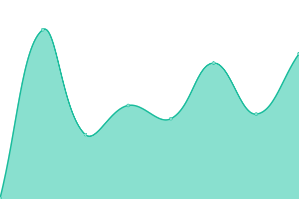

# [📈 Live Status](https://demo.upptime.js.org): <!--live status--> **🟩 All systems operational**

This repository contains the open-source uptime monitor and status page for [Frozensoft Software](https://frozensoftsoftware.com), powered by [Upptime](https://github.com/upptime/upptime).

With [Upptime](https://upptime.js.org), you can get your own unlimited and free uptime monitor and status page, powered entirely by a GitHub repository. We use [Issues](https://github.com/Frozensoft-Software/upptime/issues) as incident reports, [Actions](https://github.com/Frozensoft-Software/upptime/actions) as uptime monitors, and [Pages](https://demo.upptime.js.org) for the status page.

<!--start: status pages-->
<!-- This summary is generated by Upptime (https://github.com/upptime/upptime) -->
<!-- Do not edit this manually, your changes will be overwritten -->
<!-- prettier-ignore -->
| URL | Status | History | Response Time | Uptime |
| --- | ------ | ------- | ------------- | ------ |
|  [Website](https://frozensoft-software-website.pages.dev) | 🟩 Up | [website.yml](https://github.com/Frozensoft-Software/upptime/commits/HEAD/history/website.yml) | 

 127ms
     
 | 

<a href="https://status.frozensoftsoftware.com/history/website">100.00%</a>
    

|  Auth | 🟩 Up | [auth.yml](https://github.com/Frozensoft-Software/upptime/commits/HEAD/history/auth.yml) | 

 493ms
     
 | 

<a href="https://status.frozensoftsoftware.com/history/auth">99.46%</a>
    

|  API | 🟩 Up | [api.yml](https://github.com/Frozensoft-Software/upptime/commits/HEAD/history/api.yml) | 

 492ms
     
 | 

<a href="https://status.frozensoftsoftware.com/history/api">99.47%</a>
    

|  Admin | 🟩 Up | [admin.yml](https://github.com/Frozensoft-Software/upptime/commits/HEAD/history/admin.yml) | 

 469ms
     
 | 

<a href="https://status.frozensoftsoftware.com/history/admin">99.49%</a>
    

<!--end: status pages-->

[**Visit our status website →**](https://demo.upptime.js.org)

## 📄 License

- Powered by: [Upptime](https://github.com/upptime/upptime)
- Code: [MIT](./LICENSE) © [Frozensoft Software](https://frozensoftsoftware.com)
- Data in the `./history` directory: [Open Database License](https://opendatacommons.org/licenses/odbl/1-0/)
